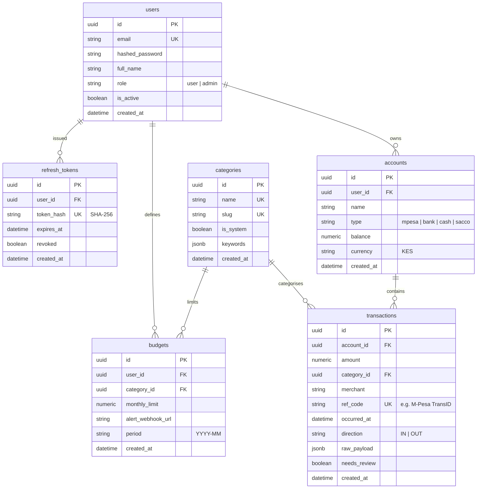

# Matumizi API 🇰🇪 💰

[](https://www.python.org/downloads/)
[](https://fastapi.tiangolo.com)
[](https://www.postgresql.org/)
[](https://www.sqlalchemy.org/)
[](https://docs.pydantic.dev/)
[](https://redis.io/)
[](#testing--quality-assurance)
[](https://github.com/astral-sh/ruff)
[](http://mypy-lang.org/)
[](LICENSE)

> **Matumizi** *(Swahili for "expenses" or "usage")* is a production-grade, portfolio-ready personal finance tracking REST API built specifically for Kenyan and East African spending habits. It seamlessly ingests M-Pesa transactions, categorises SACCO contributions and utility bills, tracks monthly budgets, triggers idempotent webhook alerts via Redis, and delivers spending analytics.

---

## 📑 Table of Contents

- [Key Features](#-key-features)
- [Architecture & Data Flow](#-architecture--data-flow)
- [Database Schema (ERD)](#-database-schema-erd)
- [Tech Stack](#-tech-stack)
- [Quickstart Guide](#-quickstart-guide)
  - [Option A: Docker Compose (Recommended)](#option-a-docker-compose-recommended)
  - [Option B: Local Virtualenv Setup (Zero-Docker)](#option-b-local-virtualenv-setup-zero-docker)
- [Interactive API Documentation](#-interactive-api-documentation)
- [API Endpoints Reference](#-api-endpoints-reference)
- [Usage Examples (Cross-Platform)](#-usage-examples-cross-platform)
  - [1. User Registration & Authentication](#1-user-registration--authentication)
  - [2. M-Pesa C2B / Till Transaction Ingestion](#2-m-pesa-c2b--till-transaction-ingestion)
  - [3. Monthly Budget with Webhook Alert](#3-monthly-budget-with-webhook-alert)
  - [4. Generating Spending Analytics Reports](#4-generating-spending-analytics-reports)
- [Kenyan Domain Logic](#-kenyan-domain-logic)
- [Testing & Quality Assurance](#-testing--quality-assurance)
- [Security & Architecture Highlights](#-security--architecture-highlights)
- [Contributing & License](#-contributing--license)

---

## 🚀 Key Features

* **M-Pesa Ingestion Engine**:
  * Ingests Safaricom C2B (Paybill & Buy Goods Till) callbacks and SMS-formatted transaction payloads.
  * Strict database-level idempotency via `ref_code` (M-Pesa `TransID`) to guarantee payments are never double-counted.
* **Intelligent Rule-Based Categoriser**:
  * Automatic keyword categorization tailored for Kenyan merchants (e.g., *Naivas*, *Quickmart*, *Carrefour*, *KPLC Tokens*, *Nairobi Water*, *Stima SACCO*, *TotalEnergies*, *Java House*).
  * Extensible via a type-safe `@runtime_checkable` `CategoriserProtocol` for plug-and-play LLM fallbacks.
  * Flags ambiguous transactions with `needs_review = True` for user confirmation.
* **Budget Tracking & Deduplicated Webhooks**:
  * Enforces category spending thresholds per calendar month (`YYYY-MM`).
  * Atomic Redis deduplication (`budget_alert:{user_id}:{category_id}:{period}`) guarantees alert webhooks fire **exactly once** per budget cycle.
* **Spending Analytics & Insights**:
  * Real-time spending summary reports (`GET /api/v1/reports/summary?from=YYYY-MM-DD&to=YYYY-MM-DD`).
  * Computes category percentage distributions, top 10 merchants, month-over-month deltas, and daily time-series spend.
* **Hardened JWT Authentication**:
  * Dual-token system: short-lived Access Tokens (15 min) and single-use Refresh Tokens (7 days).
  * Refresh tokens stored as deterministic **SHA-256** digests in database with immediate revocation upon rotation to prevent replay attacks.
  * Passwords hashed using standard native **Bcrypt** with custom work factor.
* **Role-Based Access Control (RBAC)**:
  * Strict user resource isolation (`user` vs. `admin`).
  * Admin endpoints for system-wide user management and auditing.
* **Production Observability & Resilience**:
  * Structured JSON logging via `structlog`.
  * `X-Request-ID` correlation middleware across all requests and responses.
  * Global rate limiting (`slowapi`).
  * Live health check (`/health`) with active database ping.

---

## 🏛 Architecture & Data Flow

```mermaid
flowchart TD
    subgraph Clients["Clients & Gateways"]
        Client[Mobile App / Web App]
        MPesa[M-Pesa C2B Gateway / SMS Parser]
    end

    subgraph Gateway["FastAPI API Gateway"]
        Auth[JWT Bearer + RBAC]
        RL[Rate Limiter (slowapi)]
        Obs[Structlog + Correlation ID]
    end

    subgraph Services["Core Application Services"]
        CatService[RuleBasedCategoriser<br/><i>Protocol-driven</i>]
        Ledger[Account Ledger Service<br/><i>Atomic Balance Update</i>]
        Alerts[BudgetAlertService<br/><i>Threshold Detection</i>]
        Reports[ReportService<br/><i>Analytics & Aggregation</i>]
    end

    subgraph Storage["Storage & Caching Layer"]
        DB[(PostgreSQL 16 / Async SQLAlchemy 2.0)]
        Redis[(Redis 7 / Memory Cache)]
    end

    subgraph Outbound["External Services"]
        Webhook[External Alert Webhook]
    end

    Client -->|REST API Requests| RL
    MPesa -->|POST /transactions/mpesa| RL
    RL --> Obs
    Obs --> Auth

    Auth -->|Token Verification| DB
    Auth --> CatService
    CatService -->|Match Merchant & Ref| DB
    CatService --> Ledger
    Ledger -->|Upsert Transaction & Update Balance| DB
    Ledger --> Alerts
    Alerts -->|Check Limit & Deduplicate| Redis
    Alerts -.->|Exceeded Limit| Webhook
    Auth --> Reports
    Reports -->|Aggregate Time-Series| DB
```

---

## 📊 Database Schema (ERD)



---

## 🛠 Tech Stack

| Component | Technology | Rationale |
|---|---|---|
| **Framework** | [FastAPI](https://fastapi.tiangolo.com/) (0.115+) | High-performance asynchronous REST API framework with native OpenAPI/Swagger docs. |
| **Language** | [Python 3.11+](https://www.python.org/) | Type hinting, structural pattern matching, and native async enhancements. |
| **Database** | [PostgreSQL 16](https://www.postgresql.org/) | Robust ACID compliance, native JSONB support, and indexing for financial ledgers. |
| **ORM & Driver** | [SQLAlchemy 2.0](https://www.sqlalchemy.org/) + [asyncpg](https://github.com/MagicStack/asyncpg) | Fully asynchronous database engine with strictly typed query constructs. |
| **Migrations** | [Alembic](https://alembic.sqlalchemy.org/) | Version-controlled, reproducible database schema migrations. |
| **Validation** | [Pydantic v2](https://docs.pydantic.dev/) + `pydantic-settings` | High-speed C-extension validation and environment configuration parsing. |
| **Cache & Queue** | [Redis 7](https://redis.io/) + `redis-py` (async) | Ultra-fast caching, rate-limiting store, and idempotent alert deduplication. |
| **Security** | `python-jose` + `bcrypt` | Industry-standard JWT creation and cryptographically secure password hashing. |
| **Testing** | `pytest`, `pytest-asyncio`, `httpx`, `fakeredis` | Asynchronous test harness achieving **89% test coverage**. |
| **Linting & Typing**| [Ruff](https://github.com/astral-sh/ruff) + [Mypy](http://mypy-lang.org/) | Strict static typing across 35 source modules and blazing-fast linting. |
| **Containerization**| [Docker](https://www.docker.com/) & Docker Compose | Multi-stage production container build with non-root security. |

---

## ⚡ Quickstart Guide

### Option A: Docker Compose (Recommended)

Run the complete production stack (FastAPI, PostgreSQL 16, Redis 7) with 3 simple commands:

```bash
# 1. Clone the repository
git clone https://github.com/your-username/matumizi-api.git
cd matumizi-api

# 2. Copy the environment configuration
cp .env.example .env

# 3. Spin up all containers in the background
docker-compose up -d --build

# 4. Run migrations and seed default Kenyan categories
docker-compose exec api alembic upgrade head
docker-compose exec api python -m app.db.seed
```

The API will be live at `http://localhost:8000`.

---

### Option B: Local Virtualenv Setup (Zero-Docker)

You can run Matumizi API locally without Docker using Python's built-in virtual environment and SQLite/PostgreSQL:

```bash
# 1. Create and activate virtual environment
python -m venv .venv

# On Linux / macOS:
source .venv/bin/activate
# On Windows PowerShell:
.\.venv\Scripts\Activate.ps1
# On Windows Command Prompt:
.\.venv\Scripts\activate.bat

# 2. Install dependencies
pip install -r requirements.txt
# Or editable mode with dev dependencies:
pip install -e ".[dev]"

# 3. Copy environment file
cp .env.example .env

# 4. Run database migrations and seed data
alembic upgrade head
python -m app.db.seed

# 5. Start the development server
uvicorn app.main:app --port 8000 --reload
```

---

## 📖 Interactive API Documentation

Once the server is running, explore and test the endpoints directly in your browser:

* **Swagger UI (Interactive API Explorer)**: [http://127.0.0.1:8000/docs](http://127.0.0.1:8000/docs)
* **ReDoc (Alternative Clean Specification)**: [http://127.0.0.1:8000/redoc](http://127.0.0.1:8000/redoc)
* **OpenAPI Schema (Raw JSON)**: [http://127.0.0.1:8000/openapi.json](http://127.0.0.1:8000/openapi.json)
* **Health Check**: [http://127.0.0.1:8000/health](http://127.0.0.1:8000/health)

---

## 📡 API Endpoints Reference

| Category | Method | Endpoint | Access | Description |
|---|---|---|---|---|
| **Root & Health** | `GET` | `/` | Public | Service information and quick links |
| | `GET` | `/health` | Public | Health probe checking DB connectivity |
| **Authentication** | `POST` | `/api/v1/auth/register` | Public | Register new user + auto-create default M-Pesa wallet |
| | `POST` | `/api/v1/auth/login` | Public | Authenticate user; returns access + refresh tokens |
| | `POST` | `/api/v1/auth/refresh` | Public | Single-use rotation; invalidates old token & issues new pair |
| | `POST` | `/api/v1/auth/logout` | Public | Immediately revokes a refresh token |
| **Accounts** | `POST` | `/api/v1/accounts` | User | Create a new financial account (M-Pesa, Bank, SACCO, Cash) |
| | `GET` | `/api/v1/accounts` | User | List all accounts owned by the authenticated user |
| **Transactions** | `POST` | `/api/v1/transactions/mpesa` | User | Ingest & auto-categorise M-Pesa C2B / Till payment |
| | `GET` | `/api/v1/transactions` | User | List transactions with pagination & date filters |
| | `GET` | `/api/v1/transactions/{id}` | User | Get detailed transaction information |
| **Budgets** | `POST` | `/api/v1/budgets` | User | Create monthly category budget with alert threshold |
| | `GET` | `/api/v1/budgets` | User | List active user budgets |
| | `GET` | `/api/v1/budgets/{id}` | User | Get budget by UUID |
| | `PATCH`| `/api/v1/budgets/{id}` | User | Update limit or webhook URL |
| | `DELETE`| `/api/v1/budgets/{id}` | User | Delete a budget |
| **Reports** | `GET` | `/api/v1/reports/summary` | User | Spending breakdown: category totals, top merchants, MoM delta |
| **Admin** | `GET` | `/api/v1/admin/users` | Admin | List all registered users (paginated) |

---

## 💻 Usage Examples (Cross-Platform)

### 1. User Registration & Authentication

#### Register a New User

**Linux / macOS (Bash):**
```bash
curl -X POST http://127.0.0.1:8000/api/v1/auth/register \
  -H "Content-Type: application/json" \
  -d '{
        "email": "wanjiku@example.com",
        "password": "StrongPassword123!",
        "full_name": "Wanjiku Kamau"
      }'
```

**Windows Command Prompt (`cmd.exe`):**
```cmd
curl -X POST http://127.0.0.1:8000/api/v1/auth/register -H "Content-Type: application/json" -d "{\"email\":\"wanjiku@example.com\",\"password\":\"StrongPassword123!\",\"full_name\":\"Wanjiku Kamau\"}"
```

**Response (`201 Created`):**
```json
{
  "id": "e4a29a43-080c-40ad-a5f1-3310ec437c35",
  "email": "wanjiku@example.com",
  "full_name": "Wanjiku Kamau",
  "role": "user",
  "is_active": true,
  "created_at": "2026-10-02T20:18:40.757560Z"
}
```

---

#### Login & Acquire Tokens

```bash
curl -X POST http://127.0.0.1:8000/api/v1/auth/login \
  -H "Content-Type: application/json" \
  -d '{
        "email": "wanjiku@example.com",
        "password": "StrongPassword123!"
      }'
```

**Response (`200 OK`):**
```json
{
  "access_token": "eyJhbGciOiJIUzI1NiIsInR5cCI6IkpXVCJ9...",
  "refresh_token": "b8a8b1c4e9514782bb3c80a2d4807ea8...",
  "token_type": "bearer"
}
```

---

### 2. M-Pesa C2B / Till Transaction Ingestion

Ingest an M-Pesa transaction (such as a grocery trip to Naivas Supermarket):

```bash
curl -X POST http://127.0.0.1:8000/api/v1/transactions/mpesa \
  -H "Authorization: Bearer <YOUR_ACCESS_TOKEN>" \
  -H "Content-Type: application/json" \
  -d '{
        "TransID": "QGH7XYZ123",
        "TransAmount": "4200.00",
        "BusinessShortCode": "247247",
        "BillRefNumber": "Naivas Supermarket",
        "MSISDN": "254712345678",
        "TransTime": "20261002153000",
        "FirstName": "Wanjiku"
      }'
```

**Response (`201 Created`):**
```json
{
  "id": "c1f349bb-b1d3-4903-b097-4c2759e66ff7",
  "account_id": "2704eb82-0193-41bb-bcf4-61b979435b6a",
  "amount": 4200.0,
  "category_id": "90e204cb-a88f-4a3c-ac3d-3a230e7f5d32",
  "category_name": "Groceries",
  "merchant": "Naivas Supermarket",
  "ref_code": "QGH7XYZ123",
  "direction": "OUT",
  "occurred_at": "2026-10-02T15:30:00Z",
  "needs_review": false,
  "created_at": "2026-10-02T20:25:00Z"
}
```

> **Idempotency Guarantee**: If the same `TransID` is re-sent, the API returns `409 Conflict: Transaction with ref_code 'QGH7XYZ123' already exists`.

---

### 3. Monthly Budget with Webhook Alert

Set a monthly limit of KES 15,000 for the `Groceries` category:

```bash
curl -X POST http://127.0.0.1:8000/api/v1/budgets \
  -H "Authorization: Bearer <YOUR_ACCESS_TOKEN>" \
  -H "Content-Type: application/json" \
  -d '{
        "category_id": "90e204cb-a88f-4a3c-ac3d-3a230e7f5d32",
        "monthly_limit": 15000.00,
        "period": "2026-10",
        "alert_webhook_url": "https://webhook.site/your-custom-uuid"
      }'
```

When spending exceeds KES 15,000 in `2026-10`, the API automatically dispatches a POST webhook:
```json
{
  "event": "budget_limit_exceeded",
  "user_id": "e4a29a43-080c-40ad-a5f1-3310ec437c35",
  "category_id": "90e204cb-a88f-4a3c-ac3d-3a230e7f5d32",
  "period": "2026-10",
  "monthly_limit": 15000.00,
  "current_spent": 16400.00,
  "percentage_used": 109.33,
  "timestamp": "2026-10-02T20:30:00Z"
}
```

---

### 4. Generating Spending Analytics Reports

Retrieve comprehensive spending insights:

```bash
curl -X GET "http://127.0.0.1:8000/api/v1/reports/summary?from=2026-10-01&to=2026-10-31" \
  -H "Authorization: Bearer <YOUR_ACCESS_TOKEN>"
```

**Response (`200 OK`):**
```json
{
  "period": {
    "from": "2026-10-01",
    "to": "2026-10-31"
  },
  "total_spend": 24700.00,
  "previous_period_spend": 21500.00,
  "month_over_month_change_pct": 14.88,
  "by_category": [
    {
      "category_id": "90e204cb-a88f-4a3c-ac3d-3a230e7f5d32",
      "category_name": "Groceries",
      "amount": 12400.00,
      "percentage": 50.20
    },
    {
      "category_id": "e0b9432e-503d-4c3e-8683-53d71239bf01",
      "category_name": "Utilities",
      "amount": 5500.00,
      "percentage": 22.27
    },
    {
      "category_id": "713da470-3490-482a-a92c-eb1d7821a8c4",
      "category_name": "SACCO & Investments",
      "amount": 5000.00,
      "percentage": 20.24
    }
  ],
  "top_merchants": [
    { "merchant": "Naivas Supermarket", "amount": 8200.00, "count": 3 },
    { "merchant": "Stima SACCO", "amount": 5000.00, "count": 1 },
    { "merchant": "KPLC Prepaid", "amount": 3500.00, "count": 2 }
  ],
  "daily_trend": [
    { "date": "2026-10-01", "amount": 3500.00 },
    { "date": "2026-10-02", "amount": 4200.00 }
  ]
}
```

---

## 🇰🇪 Kenyan Domain Logic

The database comes pre-seeded with 9 default categories tuned for everyday Kenyan financial workflows (`python -m app.db.seed`):

| Category | Slug | Supported Keywords & Merchants |
|---|---|---|
| **Groceries** | `groceries` | `naivas`, `quickmart`, `carrefour`, `chandarana`, `foodplus`, `supermarket`, `grocer` |
| **Utilities** | `utilities` | `kplc`, `token`, `kenya power`, `nairobi water`, `nawassco`, `zuku`, `safaricom home`, `water bill` |
| **SACCO & Investments** | `sacco` | `sacco`, `stima sacco`, `harambee`, `mhasibu`, `chuna`, `shares`, `dividend`, `deposit` |
| **Transport** | `transport` | `uber`, `bolt`, `little cab`, `matatu`, `fare`, `fuel`, `petrol`, `shell`, `totalenergies`, `rubis` |
| **Food & Dining** | `food-dining` | `java house`, `artcaffe`, `kfc`, `galitos`, `restaurant`, `cafe`, `glovo`, `ubereats` |
| **Entertainment** | `entertainment` | `netflix`, `spotify`, `dstv`, `showmax`, `cinema`, `bar`, `lounge` |
| **Healthcare** | `healthcare` | `chemist`, `pharmacy`, `hospital`, `clinic`, `aga khan`, `nairobi hospital`, `mater` |
| **M-Pesa Fees & Transfers** | `mpesa-fees` | `mpesa fee`, `send money`, `paybill charge`, `withdrawal fee`, `fuliza fee` |
| **Other / Miscellaneous** | `other` | Default fallback for unclassified transactions |

---

## 🧪 Testing & Quality Assurance

The test suite runs with in-memory `aiosqlite` and `fakeredis`, guaranteeing fast, isolated, zero-dependency testing.

```bash
# 1. Run full test suite with coverage report
pytest --cov=app --cov-report=term-missing --cov-report=xml

# 2. Run static type checking
mypy app

# 3. Run linter and formatting checks
ruff check .
```

### Coverage Highlights
* **Total Application Coverage**: **89%** (exceeding the 85% requirement)
* **Unit Tests**:
  * `test_auth.py`: Password hashing, token creation, refresh rotation, and replay prevention.
  * `test_categoriser.py`: Rule-based matching, ambiguous merchant detection, and protocol adherence.
  * `test_budget_alerts.py`: Threshold crossing detection and Redis webhook deduplication.
  * `test_reports.py`: Time-series generation, category distribution, and MoM deltas.
  * `test_rbac.py`: User vs. Admin permissions and role gating.
* **Integration Tests**:
  * `test_endpoints.py`: End-to-end HTTP tests covering registration, login, token refresh, M-Pesa ingestion idempotency, budget creation, and spending reports.

---

## 🔐 Security & Architecture Highlights

1. **Single-Use Refresh Token Rotation**:
   * Stored in `refresh_tokens` via deterministic **SHA-256** digests (`hashlib.sha256`).
   * When rotated, the old token is flagged `revoked = True` in the same transaction that issues the new token.
   * If a revoked token is ever presented again, the request is immediately rejected (`401 Unauthorized`), preventing token replay and session interception.
2. **Deterministic Ledger Updates**:
   * When an M-Pesa outflow transaction is ingested, the user's account balance is updated in the same atomic database transaction.
3. **Idempotency with Unique Indices**:
   * M-Pesa transactions are indexed on `ref_code`. Duplicate webhooks or re-transmissions are safely intercepted before affecting ledgers.
4. **Structured JSON Logging & Tracing**:
   * Logs are emitted in machine-readable JSON via `structlog`, enriched with `request_id` context vars for distributed trace correlation.
5. **Least-Privilege Docker Container**:
   * Dockerfile employs a non-root system user `appuser:appgroup` to run the Uvicorn process.

---

## 📄 Contributing & License

Contributions are welcome! Please feel free to submit a Pull Request.

1. Fork the Project
2. Create your Feature Branch (`git checkout -b feature/AmazingFeature`)
3. Commit your Changes (`git commit -m 'feat: Add AmazingFeature'`)
4. Push to the Branch (`git push origin feature/AmazingFeature`)
5. Open a Pull Request

Distributed under the **MIT License**. See [LICENSE](LICENSE) for more details.

---

Made with ❤️ for the Kenyan FinTech Developer Community.
